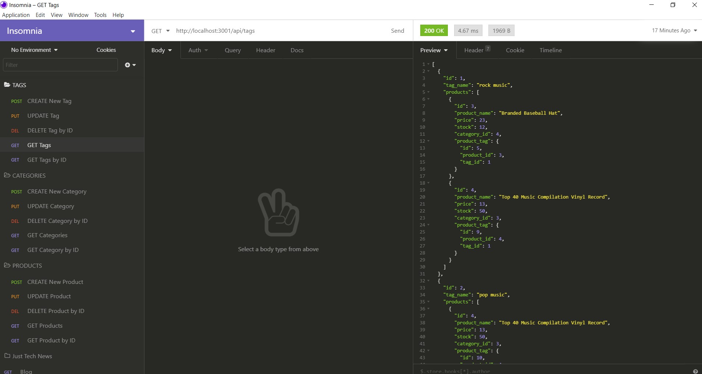

# E-Commerce Back End Application

## Description and Purpose
A back end application that can be used with an e-commerce website. The application uses Express.js back end functionality along with Sequalize to interact with a MySQL database. The application also uses the dotenv package to store MySQL environment variables.

## Table of Contents
  - [Description and Purpose](#description-and-purpose)
  - [Application Screenshot](#application-screenshot)
  - [Application Demo Videos](#application-demo-videos)
  - [Built With](#built-with)
  - [Installation](#installation)
  - [License](#license)
  - [Contributing](#contributing)
  - [Tests](#tests)
  - [Questions](#questions)

## Application Screenshot

## Application Demo Videos
### Creating schema from MySQL shell and seeding database from the command line
https://drive.google.com/file/d/19AyOGiVXtWiq4BGHtbGUyXKfKjx5arXa/view
### Starting application server

### GET routes for all categories, all products, and all tags

### GET routes for a single category, a single product, and a single tag

### POST, PUT, and DELETE routes for a categories, products, and tags

## Built With
* JavaScript
* Node.js
* Express.js
* MySQL
* Sequalize
* Dotenv

## Installation
Application can be used in any command line terminal with Node.js installed. Node depedencies can be installed by typing 'npm install' into the command line. Express server can be connected by typing 'npm start'.

Download code for this project here (zip file): https://github.com/MikeGShelby/e-commerce/archive/master.zip
Download Node here: https://nodejs.org/en/download/

## License
MIT License

## Contributing
Developed by Mike Shelby

## Tests
All API end points were tested using Insomnia Core.

## Questions
Github Username: mikegshelby

Github Profile: https://github.com/mikegshelby

Email: mikegshelby@gmail.com

Please email me with any questions about this project!